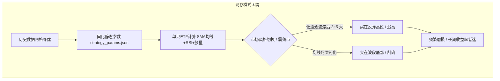
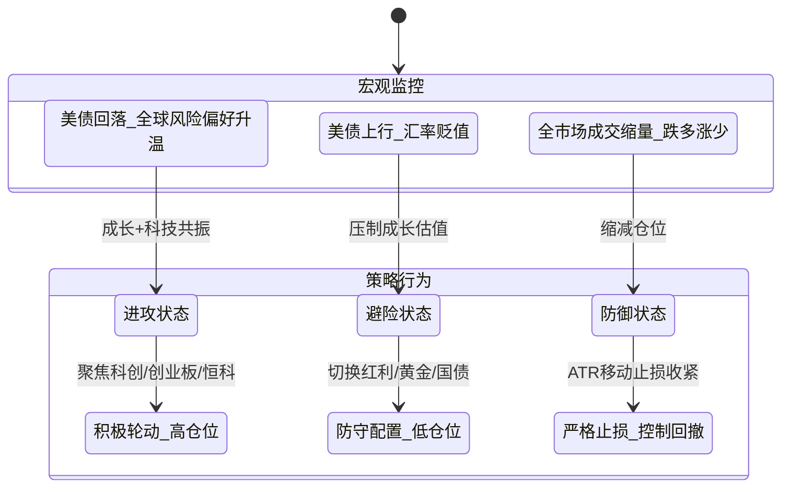
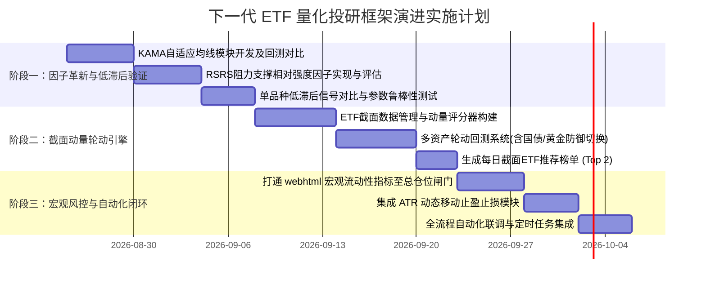

# A股 ETF 量化交易系统深度诊断与下一代演进方案

> **文档定位**：针对当前 ETF 量化系统运行近一年中出现的“收益率不显著”、“交易信号严重滞后”、“震荡市频繁磨损”等系统性问题进行深度数学与金融工程剖析，并提出系统化、可工程落地的下一代量化演进方案。  
> **文档版本**：v1.0  
> **创建日期**：2026-08-23  

---

## 目录
- [一、 执行摘要与问题总览](#一-执行摘要与问题总览)
- [二、 现存量化系统运行现状与架构拆解](#二-现存量化系统运行现状与架构拆解)
- [三、 核心痛点与数学/金融机理深度剖析](#三-核心痛点与数学金融机理深度剖析)
  - [3.1 信号严重后置的数学本质：低通滤波器的相位滞后](#31-信号严重后置的数学本质低通滤波器的相位滞后)
  - [3.2 参数静态固化的过拟合陷阱与 Alpha 衰减](#32-参数静态固化的过拟合陷阱与-alpha-衰减)
  - [3.3 “单品种时序交易”与 A 股 ETF 震荡市的天然冲突](#33-单品种时序交易与-a-股-etf-震荡市的天然冲突)
  - [3.4 维度单一与宏观数据孤岛效应](#34-维度单一与宏观数据孤岛效应)
- [四、 下一代 ETF 量化投研体系设计](#四-下一代-etf-量化投研体系设计)
  - [4.1 总体架构：三层动态自适应量化框架](#41-总体架构三层动态自适应量化框架)
  - [4.2 因子层革新：低滞后与前瞻性特征](#42-因子层革新低滞后与前瞻性特征)
  - [4.3 策略层跃迁：从“单品种择时”走向“多资产截面动量轮动”](#43-策略层跃迁从单品种择时走向多资产截面动量轮动)
  - [4.4 状态机与风控层：打通宏观资产流动性闸门](#44-状态机与风控层打通宏观资产流动性闸门)
- [五、 新旧量化体系全方位对比矩阵](#五-新旧量化体系全方位对比矩阵)
- [六、 模块化工程落地路线图](#六-模块化工程落地路线图)

---

## 一、 执行摘要与问题总览

当前项目构建了一套完整的量化交易闭环：**数据获取 $\rightarrow$ 策略指标计算 $\rightarrow$ 历史参数滚动寻优 $\rightarrow$ 参数固化 $\rightarrow$ 每日自动化监控与邮件推送**。然而在近一年的实盘跟踪中，该系统表现出两个核心瓶颈：
1. **收益率平淡（甚至跑不赢基准）**：未能在结构性行情中捕获主升浪，在震荡市中资金反复遭受假信号磨损。
2. **交易信号严重滞后（后置性明显）**：买入信号往往出现在行情已大幅反弹的半山腰或短期顶部；卖出信号往往出现在下跌中继甚至波段底部。



---

## 二、 现存量化系统运行现状与架构拆解

### 2.1 现有策略逻辑 (`sdd.py` 与 `autoProcess.py`)

当前策略主要采用经典技术指标组合的**时序择时（Time-Series Timing）**逻辑：

```mermaid
flowchart LR
    subgraph 现有入场条件 (OR)
        C1[均线金叉 diff=1 且 放量 >= 均量 * MaRateUp]
        C2[RSI 超卖 < rsiValueThd 且 放量 >= 均量 * rsiRateUp]
        C3[均线空头状态下 乖离率 > divergence_threshold]
    end

    subgraph 现有出场条件 (OR)
        S1[均线死叉 diff=-1]
        S2[收盘价跌破长期与短期均线]
        S3[均线上升趋势中放出天量 VolumeSellRate]
    end

    C1 & C2 & C3 --> BUY[买入信号 Signal = 1]
    S1 & S2 & S3 --> SELL[卖出信号 Signal = -1]
```

### 2.2 现行参数优化与执行链条

1. **离线优化**：通过 `findGoodParam` / `find_best_params` 对历史几百个交易日进行网格扫描或随机扰动，寻找回测收益率和胜率最高的参数（例如短期均线 3、长期均线 12、RSI 周期 11 等）。
2. **参数固化**：将每只 ETF 最优参数持久化在 `strategy_params.json` 中。
3. **线上执行**：每日交易时段运行 `autoProcess.py`，加载对应参数，计算当日指标并生成买卖指令。

---

## 三、 核心痛点与数学/金融机理深度剖析

### 3.1 信号严重后置的数学本质：低通滤波器的相位滞后

#### ① 均线系统的群延迟（Group Delay）
移动平均线（SMA）在信号处理领域属于典型的**线性低通滤波器**。其频率响应会导致原始价格信号发生明显的相位滞后。对于长度为 $N$ 的简单移动平均线，其平均群延迟 $\tau$ 为：
$$\tau_{\text{SMA}} = \frac{N - 1}{2} \text{ 个交易日}$$

当使用 **3日短期均线** 与 **12日长期均线** 做交叉（Cross-over）判断时：
* 短均线自身滞后约 $1$ 天；
* 长均线自身滞后约 $5.5$ 天；
* 两条均线要发生金叉，价格必须在拐点后持续反弹数日以拉动均线拐头，**实际信号确认点平均落后真实价格拐点 3 ~ 6 个交易日**。

#### ② 实盘行情的代价
对于科创50（588180）、创业板（159915）、恒生科技（513160）等高弹性资产，一轮波段反弹的前 3~5 个交易日往往集中了 **60% 以上的涨幅**：
* 均线金叉确认时，价格已从底部反弹 8%~12%，此时买入极易接盘短期回调；
* 均线死叉确认时，价格已从高点回撤 7%~10%，甚至跌至强支撑位，此时卖出直接割在波段底部。

---

### 3.2 参数静态固化的过拟合陷阱与 Alpha 衰减

#### ① 数据窥探偏差（Data Snooping Bias）
在 `strategy_params.json` 中，每个标的都固化了非常个性化的高精度参数：
```json
"159843": { "short_window": 3, "long_window": 12, "rsi_period": 7, "rsiValueThd": 24, "divergence_threshold": 0.037 },
"512820": { "short_window": 5, "long_window": 15, "rsi_period": 14, "rsiValueThd": 30, "divergence_threshold": 0.014 }
```
这些参数本质上是在**有限的历史样本中寻找局部极值**。当参数自由度过高（均线周期、均量倍数、RSI周期、超卖阈值、乖离率阈值等超过 8 个自由参数）时，回测中的高胜率极大概率是**噪声拟合**。

#### ② 金融时间序列的非平稳性（Non-stationarity）
市场状态（Market Regime）会随着宏观流动性、政策、主力资金偏好持续漂移：
* **2022-2023年**：熊市/震荡缩量市，均值回归因子（超跌反弹、RSI 低吸）占优；
* **2024年下半年（924行情）**：流动性脉冲式暴涨，动量突破因子占优，均值回归（超买卖出）直接踏空主升浪；
* **2025-2026年**：结构性分化与高频轮动，单一静态参数迅速失真，Alpha 发生剧烈衰减。

---

### 3.3 “单品种时序交易”与 A 股 ETF 震荡市的天然冲突

* **A 股 ETF 的真实状态分布**：单只行业/主题 ETF 全年约 **70% 的时间处于无明显趋势的箱体震荡**，单边趋势时间仅占 20%~30%。
* **锯齿磨损（Whipsaw Loss）**：在震荡市中，均线交叉策略会频繁在箱体顶部产生“假突破买入”，在箱体底部产生“假跌破卖出”，导致本金在没有系统性趋势时被持续消耗。
* **为什么公募/私募量化更青睐“截面轮动”？**
  * 单只 ETF 很难预测明天是涨是跌（时序预测难度极高）；
  * 但在一组 ETF 中，预测“未来 5 天科技 ETF 是否比消费 ETF 更强”（截面相对强弱）的**信噪比（Signal-to-Noise Ratio, SNR）远高于单品种时序预测**。

---

### 3.4 维度单一与宏观数据孤岛效应

当前项目的各模块之间存在明显的“信息割裂”：
* **`webhtml` 模块**：已经实时监控了美债 10 年期收益率、美元离岸汇率、日债、中概金龙指数、A 股全市场涨跌家数比、跨资产风险偏好等核心宏观数据。
* **`sdd.py` 策略模块**：执行时却完全是一个封闭孤岛，只读取该股票自身的 `CloseValue` 与 `Volume`，对宏观流动性是“盲目”的。

> **典型案例**：当全球美债利率飙升、美元走强、A股全市场80%股票下跌时，即使某只芯片 ETF 出现日线级别的均线金叉，也极大概率是诱多假信号。若无宏观闸门过滤，策略会盲目触发买入。

---

## 四、 下一代 ETF 量化投研体系设计

针对上述四大瓶颈，我们构建**“宏观闸门 + 截面轮动 + 低滞后执行”**的三层量化体系。

### 4.1 总体架构：三层动态自适应量化框架

```mermaid
graph TD
    subgraph Layer1 [顶层：宏观与市场状态机 (Regime Filter)]
        M1[美债10Y / 离岸汇率 / 日债]
        M2[全市场涨跌比 / 情绪温度]
        M3[宽基指数均线牛熊线 (MA60/ADX)]
        M1 & M2 & M3 --> R_State{宏观与市场状态判定}
        R_State -->|强动量市| POS_HIGH[总仓位上限 80%~100%]
        R_State -->|宽幅震荡市| POS_MID[总仓位上限 40%~60%]
        R_State -->|流动性收紧/熊市| POS_LOW[总仓位上限 0%~20% / 转国债ETF]
    end

    subgraph Layer2 [中层：多资产 ETF 截面动量轮动池 (Cross-Section Engine)]
        Pool[ETF监控池: 科技 / 消费 / 周期 / 红利 / 海外 / 防御]
        Score[多因子复合评分: 风险调整动量 + RSRS + 资金流]
        Pool --> Score
        POS_HIGH & POS_MID --> Score
        Score --> Select[选出全市场最强 Top 2~3 只 ETF]
    end

    subgraph Layer3 [底层：低滞后入场执行与动态风控 (Execution & Risk)]
        Select --> Exec{执行信号触发}
        Exec --> KAMA[KAMA 自适应均线变速]
        Exec --> ATR_Break[ATR 波动率通道突破]
        Exec --> Trail_Stop[ATR 动态移动止盈止损]
    end
```

---

### 4.2 因子层革新：低滞后与前瞻性特征

为了彻底解决均线滞后问题，引入三大具有高信噪比与快速响应特性的因子：

#### ① RSRS（阻力支撑相对强度）因子 —— 识别拐点领先神器
* **数学原理**：利用每日最高价 $High$ 和最低价 $Low$ 进行 OLS 线性回归：
  $$High_t = \alpha + \beta \cdot Low_t + \epsilon_t$$
  计算得到斜率 $\beta$。$\beta$ 反映了支撑转化为阻力的传导效率。对 $\beta$ 进行 $Z\text{-score}$ 标准化并结合拟合优度 $R^2$ 修正：
  $$RSRS\_Score = Z(\beta) \times R^2$$
* **优势**：直接从每日盘中多空博弈力量（最高/最低价分布）中提取信号，**比收盘价均线金叉领先 2~4 个交易日确认底部拐点**。

#### ② KAMA（考夫曼自适应移动平均） —— 消除震荡磨损
* **数学原理**：通过效率比（Efficiency Ratio, $ER$）动态调节平滑系数：
  $$ER = \frac{|\text{Price}_t - \text{Price}_{t-n}|}{\sum_{i=1}^n |\text{Price}_i - \text{Price}_{i-1}|}$$
  * **单边趋势市（$ER \to 1$）**：平滑系数自动逼近快速均线（如 2 日线），迅速捕捉主升浪；
  * **箱体震荡市（$ER \to 0$）**：平滑系数自动逼近慢速均线（如 30 日线），保持平直，彻底过滤假突破。

#### ③ Donchian / ATR 真实波幅突破通道 —— 动量入场标准
* 放弃“等两条线交叉”，改用“价格突破过去 $N$ 日高点且真实波动率（ATR）放大”作为触发条件，入场果断，避免买在反弹尾声。

---

### 4.3 策略层跃迁：从“单品种择时”走向“多资产截面动量轮动”

#### ① 核心监控池划分（均衡覆盖全市场主要 Beta）
| 资产大类 | 代表性 ETF 代码 | 经济周期驱动核心 |
| :--- | :--- | :--- |
| **高弹性科技** | 科创50 (`588180`) / 创业板 (`159915`) | 全球科技周期、半导体、流动性宽松 |
| **核心消费医药** | 食品饮料 (`159843`) / 港股消费 (`511090`) | 内需复苏、居民消费意愿、防御属性 |
| **红利/大金融** | 银行/证券 (`512820`) / 红利低波 | 无风险利率下行、高股息防御底仓 |
| **海外/全球资产** | 恒生科技 (`513160`) / 纳指 ETF / 黄金 ETF | 全球风险偏好、美元指数、降息预期 |
| **防御避风港** | 国债 ETF (`511090`) / 货币 ETF | 市场系统性风险、流动性危机 |

#### ② 截面动量评分公式（Risk-Adjusted Momentum）
在每周初或每 3 个交易日，计算池中所有 ETF 的复合评分：
$$\text{Score}_i = w_1 \cdot \frac{\text{Return}_{i, 20D}}{\text{ATR}_{i, 20D}} + w_2 \cdot RSRS\_Score_i + w_3 \cdot \text{Volume\_Ratio}_i$$

* **规则**：
  1. 始终持有**排名前 2 名**的 ETF；
  2. 若排名前列的 ETF 评分均低于基准阈值（表明全市场走弱），则**自动将仓位切换至国债 ETF 或空仓现金**；
  3. 只要某板块有行情（无论科技牛、资源牛还是红利牛），系统自动轮动至最强赛道。

---

### 4.4 状态机与风控层：打通宏观资产流动性闸门

将 `webhtml` 中的跨资产数据转化为交易系统的**顶层控制开关**：



* **风控执行：ATR 移动追踪止损（Trailing Stop）**
  * 买入后，止损线设为：$\text{StopPrice} = \text{最高价} - 2.5 \times \text{ATR}_{14}$；
  * 随着价格上涨，止损线单调上移，锁定波段利润；价格跌破止损线无条件平仓。

---

## 五、 新旧量化体系全方位对比矩阵

| 评估维度 | 现存系统 (Current State) | 下一代系统 (Next-Gen Architecture) | 预期提升成效 |
| :--- | :--- | :--- | :--- |
| **核心算法** | 静态 SMA 均线交叉 + 静态 RSI | RSRS 相对强度 + KAMA 自适应均线 + 截面动量 | 信号领先 **2~4 个交易日**，消除后置性 |
| **策略类型** | 单品种独立时序择时 | 全市场多资产截面强弱轮动 | 解决单只 ETF 震荡市频繁磨损问题 |
| **参数机制** | 滚动寻优后静态固化 (`strategy_params.json`) | 自适应动态参数（根据近期波动率和效率比自调节） | 消除过拟合（Overfitting），抵抗风格漂移 |
| **宏观联动** | 孤立运行（不看宏观数据） | 深度打通 `webhtml` 全球宏观、美债、汇率闸门 | 规避宏观流动性黑天鹅，大幅降低最大回撤 |
| **风控机制** | 跌破均线被动卖出 | ATR 动态波动率加权 + 移动追踪止盈止损 | 保护波段利润，单次交易亏损严格可控 |
| **执行周期** | 仅依赖日线收盘价 | 日线定方向 + 截面排序 + 盘尾 14:20 精确撮合 | 减少隔夜跳空滑点 |

---

## 六、 模块化工程落地路线图

为确保系统升级平稳、风险可控，建议采用**三阶段渐进式落地**：



### 1. 阶段一：低滞后因子重构与测试（低成本、快速验证）
* 在现有的 `sdd.py` 框架中编写 `calc_kama()` 与 `calc_rsrs()` 函数；
* 用历史行情（如 588180、159915、159843）直接对比：**旧均线金叉 vs RSRS/KAMA 信号的入场时机与回撤表现**。

### 2. 阶段二：搭建 ETF 截面轮动模块 (`etf_rotation.py`)
* 建立包含 8~10 只核心 ETF 的标的池；
* 实现风险调整后动量排名机制，在每日收盘时输出全市场最强赛道。

### 3. 阶段三：宏观风控与全流程闭环
* 将 `webhtml` 宏观指标（美债、汇率、A股涨跌比）封装为统一的 `MacroRegime` 模块；
* 结合 ATR 移动止损，打通每日开盘与尾盘的自动化执行与邮件推送。

---

> **结语**：量化投资的本质不是寻找一套“能够预测未来所有行情的静态魔术公式”，而是建立一个**“在趋势明确时敏锐跟随、在震荡低迷时保全本金、在风格切换时自动轮动”的自适应动态系统**。本方案从数学机理和金融逻辑上重构了系统，为后续实现稳健超额收益奠定了坚实基础。
